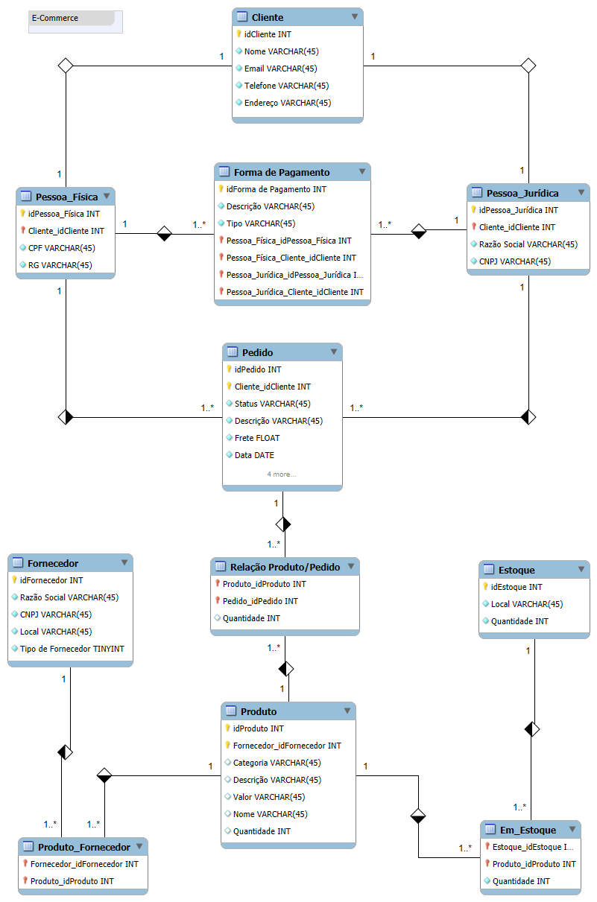

# eCommerce-DB: Modelo ER de Estudo para E-commerce

Este repositório contém um diagrama de banco de dados relacional criado para fins de estudo, com foco em sistemas de e-commerce. O modelo abrange entidades e relacionamentos básicos para gerenciar clientes, pedidos, produtos, fornecedores, estoque e formas de pagamento.

## 🖼️ Diagrama ER

## 📋 Estrutura do Modelo

- **Cliente**: Inclui dados de pessoas físicas (CPF) e jurídicas (CNPJ).  
- **Pedido**: Representa as compras realizadas pelos clientes.  
- **Produto**: Armazena informações dos itens vendidos.  
- **Fornecedor**: Registra fornecedores dos produtos.  
- **Estoque**: Gerencia locais e quantidades de produtos.  
- **Forma de Pagamento**: Define os métodos de pagamento disponíveis.  

## 🖼️ Diagrama ER
O diagrama completo está disponível no arquivo **e-commerce-diagrama.png**.

---

**Projeto de estudo para prática de modelagem de banco de dados.**
